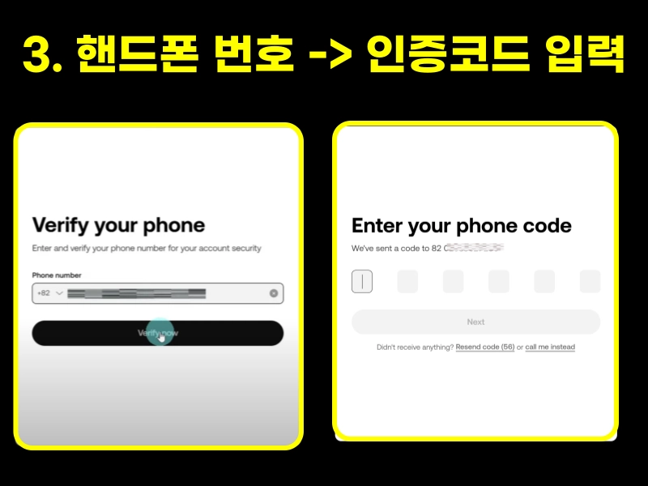

# How to Sign Up for OKX Exchange and Lock in Lifetime Maximum Fee Discounts

Looking to join one of the world's leading cryptocurrency exchanges with rock-bottom fees? OKX (formerly OKEX) offers access to 350+ cryptocurrencies, 500+ trading pairs, and up to 125x leverage on futures—all while providing permanent fee discounts when you sign up correctly. This guide walks you through the complete registration process, KYC verification, and security setup in under 10 minutes.

---

OKX has been operating since 2017 and consistently ranks among the top global crypto platforms. What makes it stand out? Low trading fees, early access to newly listed coins before they hit domestic exchanges, and the ability to profit in both bull and bear markets through futures trading.

The key to maximizing your benefits? Using the right referral code during signup to secure lifetime fee reductions.

## 1) Creating Your Account

Start by clicking the official registration link. You'll land on the homepage where the signup process begins.

### Step 1: Select Your Country

Type "KO" in the country selector and choose South Korea. A confirmation window will pop up—click "Confirm" to proceed.

### Step 2: Enter Your Email

Here's the crucial part: Before entering your email, verify that the referral code field shows **"62834398"**. This code unlocks your lifetime maximum fee discount. Once confirmed, enter your email address and click "Sign up."

You'll receive a 6-digit verification code via email. Copy this code, paste it into the verification field, and click "Next."

### Step 3: Add Your Phone Number

Enter your mobile number and click "Verify now." This adds an extra security layer to your account.

### Step 4: Create a Strong Password

Your password needs to meet these requirements:
- 8 to 32 characters long
- At least 1 uppercase letter
- At least 1 lowercase letter
- At least 1 number
- At least 1 special character

👉 [Ready to start trading with maximum fee discounts? Complete your OKX registration now](https://www.okx.com/join/62834398)

## 2) Identity Verification (KYC)

### Step 1: Install the OKX Mobile App

Once your email account is created, download the OKX app on your phone. iPhone users go to the App Store, Android users head to the Play Store.

### Step 2: Log Into the App

Open the app and allow notifications when prompted. Click "Log in," enter your email, then click "Next." Enter your password and click "Log in" again.

You'll see a puzzle verification—tap the images in the correct order, then click "Confirm." A 6-digit verification code will be sent to your phone. Enter it to complete login.

(If a "Create Passkey" window appears, you can skip it by clicking the X—you can set this up later.)

### Step 3: Start KYC Identity Verification

Tap "Verify Now" on the main screen. On the next screen, tap "Verify now" again. Confirm "South Korea" is selected as your country, then click "Next."

### Step 4: Choose Your ID Type

Select which document you'll use for verification:
- Driver's license
- National ID Card
- Passport

For this guide, we'll use a driver's license. Select "Driver's license" and click "Next." When prompted, allow camera access.

### Step 5: Photograph Your ID (Front & Back)

Click "Start Verification" to begin. Position your ID's front side within the frame—the app will automatically capture it when properly aligned. If the photo looks good, click "Next."

Repeat the process for the back of your ID, then click "Next" again.

### Step 6: Take a Selfie

Time for facial verification. Click "Next" and the camera will open. Follow the on-screen instructions to capture your face.

Once complete, you're done with KYC verification! You'll see a message indicating results will be available within 2 minutes.

### Step 7: Confirm Personal Information

An automatic personal information screen will appear. Review all details for accuracy and click "Next."

(If this screen doesn't appear immediately, tap the X in the upper right corner or "Back to homepage" at the bottom.)

When verification completes, you'll see "Verify Identity" with a "Continue verification" button below it. Click it to proceed.

### Step 8: Enter Your Address

Input your address details excluding country and province: street address, city, province, and postal code. Once submitted, identity verification is complete!

👉 [Lock in your lifetime fee discount before you forget—sign up for OKX today](https://www.okx.com/join/62834398)

## 3) Google OTP Security Setup

### Step 1: Verify Identity Completion

Tap the square icon in the upper left corner. If your profile shows a green "Verified" badge, your identity verification succeeded.

### Step 2: Begin Security Setup

Click on your profile, then select "Security" (second option down). Next, click "Authenticator app" (second option), then "Set up now."

### Step 3: Get Your Secret Key

Enter the verification codes sent to both your phone and email, then click to reveal your secret key on screen.

If you don't have Google Authenticator installed yet, click "Google Authenticator" to download the app, then continue with setup.

### Step 4-1: Install Google Authenticator

### Step 4-2: Launch the App

After installation, open Google Authenticator. Tap through: "Get started" → "Add a code" → "Enter a setup key."

For the account name, type "OKX" or "OKX Exchange." In the "Your key" field, paste the secret key you copied from the OKX app. Tap "Add."

### Step 4-3: Enter the OTP Code

After tapping "Add," a 6-digit authentication code appears for OKX. Tap the code to copy it.

(Note the gray circle on the right side—it's counting down. You need to enter this code in the OKX app before the timer expires.)

    

### Step 4-4: Complete OTP Setup

Return to the OKX app and paste the 6-digit code. That's it—you're done!

You've now completed the entire OKX exchange registration process, including KYC verification and Google OTP security setup.

---

## Conclusion

Setting up your OKX account takes less than 10 minutes but provides lifetime benefits. You now have access to one of the world's most comprehensive crypto trading platforms with maximum fee discounts permanently applied to your account. OKX's combination of low fees, early coin listings, and advanced trading features makes it ideal for both new and experienced traders looking to maximize their crypto opportunities. Remember, the [referral code 62834398](https://www.okx.com/join/62834398) ensures you're getting the best possible fee structure from day one.
